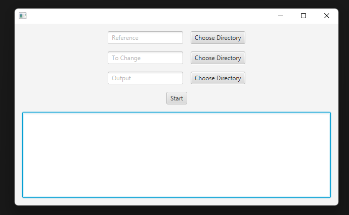
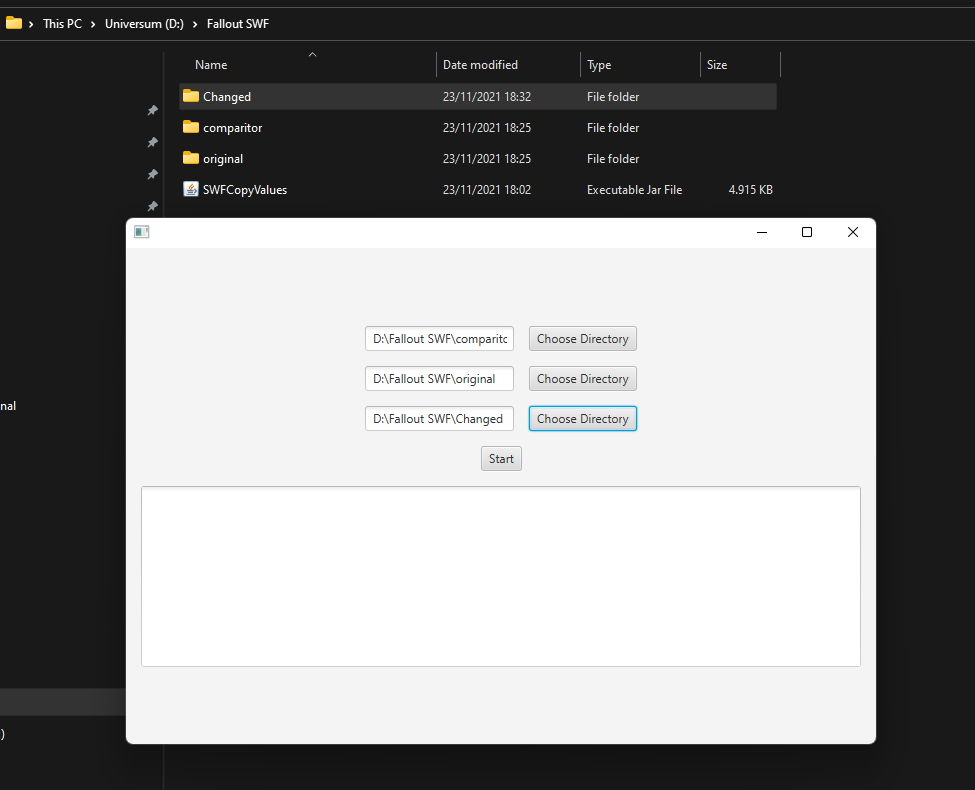
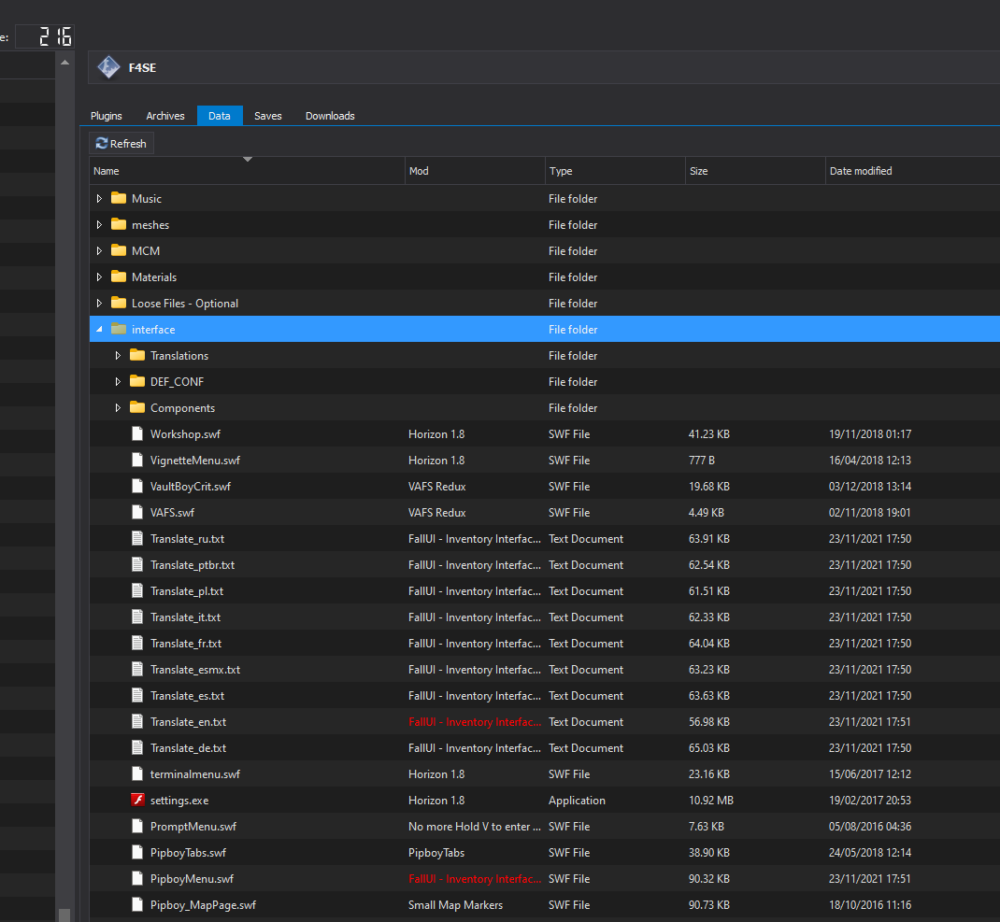
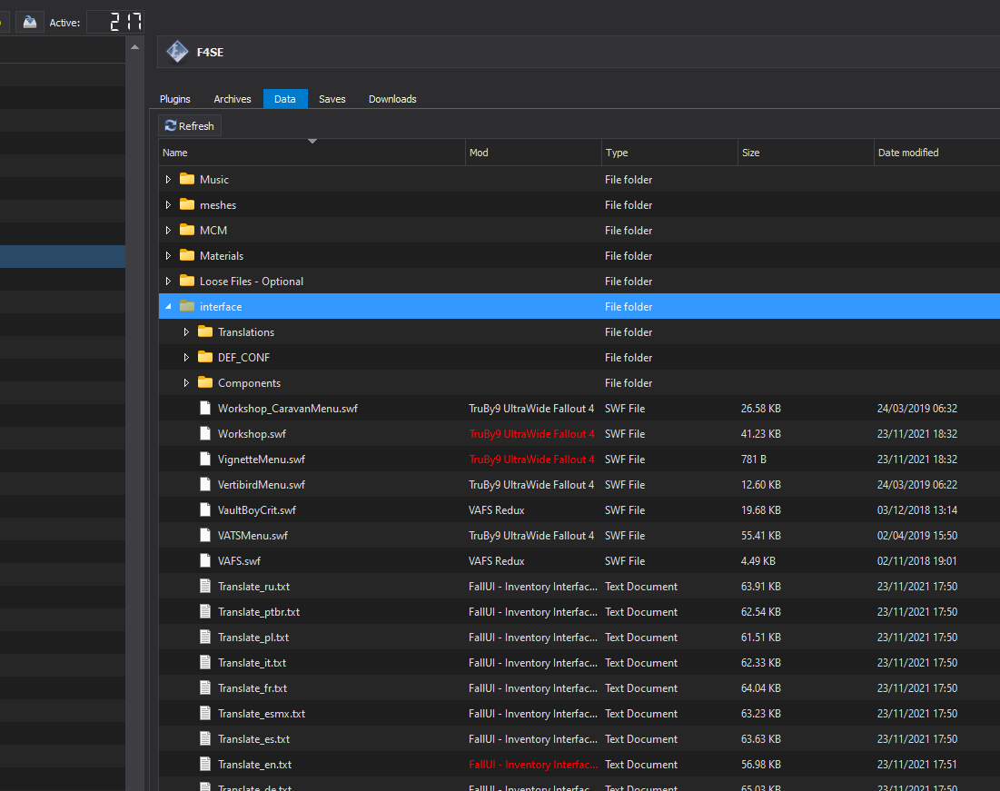

# SWFCopyValues
Used for Fallout 4 to fix 21:9 (or any other than 16:9) resolution problems

You will need .swf files that have already been changed (resolution wise) to look correct

For 21:9 I recommend using these: https://www.nexusmods.com/fallout4/mods/24630

The other thing that is required, is knowing which .swf files get replaced by a mod (that is not just there to fix resolution problems)

For that you should take a look in your Mod Manager and see which .swf files get replaced by mods like Horizon or FallUI and so on - copy all of these in a new folder which you will use later on as the directory for the files that need to be changed

## Reason why we can't just use old mods that fix the resolution
Other mods (like Horizon, BetterConsole, ...) add additional functionalities in these files (like tags / icons)

Unless the 21:9 resolution mod is very recently built (and has compatibility with these mods) it will remove these new functionalities

## How it works
There are three directories:
* Reference: The reference .swf files (for example from Truby9s mod)
* To Change: The .swf files that are loaded in your game, that have the correct functionality (but wrong resolution)
* Output: The output (as in new files with the functionality and correct resolution)

As a first step the program copies the header values for maximum y and x (which determines the resolution of the .swf file)

After that it goes through every frame of the .swf file and copies the matrix values of the objects inside those frames

(these often have changed translateX values due to the wider screen - sometimes some other stuff is changed as well)

## Example
Starting the application: `java -jar SWFCopyValues.jar`

**Important**: 

Currently it requires `Java 8` since at some point (`Java 11`?) the `JavaFX` dependency was removed and has to be added as a dependency

If your Java version is higher install `Java 8` additionally and reference it directly

In my case it would then look like this: `"C:\Program Files\Java\jre1.8.0_311\bin\java" -jar SWFCopyValues.jar`

---
This is how the actual application looks like

You can see that you will have to select three directories - these are explained above

---
Here is an example on how it would like

---
This is how you decide which .swf files to change

In here you can see that the mod organizer tool shows which .swf files (stored in `/interface/`) are provided by various mods (e. g. `Horizon`)

Adding a mod that fixes the resoultion problems shows that it overrides these .swf files (if the load order is properly configured)

This would fix the resolution problems but remove the added features from the mods (e. g. `Horizon`)

That is why these .swf files will have to be changed by this application

## Additional Info
In this project I use the SWF-Library from https://github.com/jindrapetrik/jpexs-decompiler 

If you wish to run this locally (not using the .jar in 'Releases') you will need to grab the following libraries from the project linked above:
* avi
* cmykjpeg
* flashdebugger
* gif
* gnujpdf
* graphs
* jl1.0.1
* jpacker
* LZMA
* nellymoser
* sfntly
* ttf
